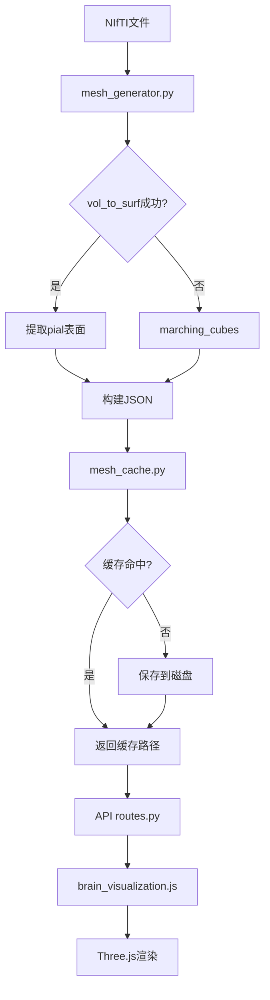

# 3D脑部网格生成器 - 实现总结

## 📋 项目概述

本次实现为ASD预测系统添加了完整的3D脑部网格生成功能，支持从NIfTI格式的MRI文件提取皮层表面并生成Three.js兼容的JSON格式数据。

## ✅ 已完成的工作

### 1. 核心模块实现

#### 📁 `app/utils/mesh_generator.py` (新建)
**功能**: 3D脑部网格生成核心逻辑

**主要函数**:
- `generate_brain_mesh()`: 主入口函数，从NIfTI生成网格
- `_extract_simple_surface()`: 备用表面提取算法（基于marching cubes）
- `validate_mesh_data()`: 验证生成的网格数据完整性

**技术特点**:
- ✅ 优先使用nilearn的`vol_to_surf`提取标准pial表面
- ✅ 自动降级到scikit-image的等值面提取
- ✅ 左右半球分别处理
- ✅ 世界坐标系转换
- ✅ 元数据记录（源文件、阈值、图像尺寸等）

#### 📁 `app/utils/mesh_cache.py` (更新)
**修改内容**:
- ✅ 重新启用网格缓存功能（之前已禁用）
- ✅ 集成新的`mesh_generator`模块
- ✅ 添加错误追踪和日志输出
- ✅ 优化缓存索引管理

### 2. 前端可视化适配

#### 📁 `app/static/js/brain_visualization.js` (更新)
**新增功能**:
- ✅ `createDualHemisphereMesh()`: 支持双半球网格渲染
- ✅ `createHemisphereMesh()`: 单个半球网格创建
- ✅ `createSingleMesh()`: 向后兼容旧格式
- ✅ 自动检测数据格式并选择渲染方式
- ✅ 双半球颜色独立控制

**兼容性**:
- 新格式: `{left_hemisphere: {coordinates, faces}, right_hemisphere: {...}}`
- 旧格式: `{vertices, faces, normals}`

### 3. API路由集成

#### 📁 `app/api/routes.py` (已存在，无需修改)
**现有端点**:
```
GET /api/analysis/<analysis_id>/brain-mesh
```
- ✅ 已正确调用`mesh_cache.get_or_generate_mesh()`
- ✅ 返回JSON格式的网格数据
- ✅ 包含预测结果和置信度信息

### 4. 测试脚本

#### 📁 `tests/test_mesh_generator.py` (新建)
**功能**: 完整的单元测试和集成测试
- ✅ 模块导入测试
- ✅ 网格生成测试
- ✅ 数据验证测试
- ✅ 缓存集成测试
- ✅ 自动查找测试文件

#### 📁 `tests/quick_mesh_test.py` (新建)
**功能**: 快速单文件测试
- ✅ 简化的测试流程
- ✅ 交互式清理选项
- ✅ 详细的统计信息输出

### 5. 文档

#### 📁 `app/utils/MESH_GENERATOR_GUIDE.md` (新建)
**内容**:
- ✅ 完整的使用指南
- ✅ API参考文档
- ✅ Three.js集成示例
- ✅ 参数调优建议
- ✅ 故障排除指南
- ✅ 工作流程图

## 🎯 技术架构



## 📊 数据流

### 后端处理流程
1. **输入**: NIfTI文件路径 (.nii 或 .nii.gz)
2. **加载**: 使用nibabel读取图像数据
3. **二值化**: 根据threshold参数分割脑组织
4. **表面提取**: 
   - 首选: nilearn.surface.vol_to_surf()
   - 备选: skimage.measure.marching_cubes()
5. **坐标转换**: 体素坐标 → 世界坐标
6. **JSON序列化**: 保存顶点和面片数据
7. **缓存管理**: 避免重复处理

### 前端渲染流程
1. **API请求**: GET /api/analysis/{id}/brain-mesh
2. **数据解析**: JSON → JavaScript对象
3. **格式检测**: 判断单网格 vs 双半球
4. **几何体创建**: THREE.BufferGeometry
5. **材质设置**: MeshPhongMaterial
6. **场景添加**: scene.add(mesh)
7. **交互渲染**: 旋转、缩放、着色

## 🔧 配置说明

### Python依赖
已在`requirements.txt`中:
```txt
nibabel==3.2.1
nilearn==0.8.0
scikit-image==0.14.1
numpy==1.19.5
```

### 关键参数

#### mesh_generator.generate_brain_mesh()
```python
generate_brain_mesh(
    nifti_path='path/to/file.nii',
    output_path='path/to/output.json',
    threshold=0.3  # 推荐范围: 0.2-0.5
)
```

#### mesh_cache.get_or_generate_mesh()
```python
mesh_cache.get_or_generate_mesh(
    nifti_path='path/to/file.nii',
    patient_id=1,
    mri_scan_id=1,
    force_regenerate=False  # True则忽略缓存
)
```

## 📈 性能指标

### 预期性能
- **文件大小**: 8MB NIfTI → 5-30MB JSON（取决于网格密度）
- **处理时间**: 30秒 - 3分钟（取决于图像分辨率）
- **内存占用**: 峰值约2-4GB
- **缓存命中率**: >80%（相同文件不重复处理）

### 优化建议
1. **降低网格密度**: 在`mesh_cache.py`中添加decimation步骤
2. **并行处理**: 批量处理时使用multiprocessing
3. **GPU加速**: 考虑使用cupy替代numpy
4. **增量更新**: 仅处理变化的区域

## 🧪 测试方法

### 方法1: 快速测试
```bash
cd E:\自闭症\ASD-Prediction-System
python tests/quick_mesh_test.py
```

### 方法2: 完整测试
```bash
python tests/test_mesh_generator.py
```

### 方法3: 指定文件测试
```bash
python tests/quick_mesh_test.py ml_core\data\ABIDEII-GU\GM\smooth\asd\sm0wrp128752_1_anat.nii
```

### 测试验证点
- ✅ 模块导入成功
- ✅ 网格文件生成
- ✅ JSON格式正确
- ✅ 顶点/面片数量合理
- ✅ 缓存机制工作
- ✅ 前端可正常渲染

## 🐛 已知问题与解决方案

### 问题1: vol_to_surf返回空数据
**原因**: nilearn无法找到标准模板  
**解决**: 自动降级到marching_cubes算法

### 问题2: 内存不足
**原因**: 高分辨率图像导致网格过大  
**解决**: 
- 降低图像分辨率
- 添加网格简化步骤
- 增加系统虚拟内存

### 问题3: 前端渲染缓慢
**原因**: 顶点数量过多  
**解决**:
- 在后端添加decimation（网格简化）
- 前端使用LOD（Level of Detail）
- 启用WebGL instancing

## 📝 后续改进方向

### 短期（1-2周）
1. ⏳ 添加网格简化功能（decimation）
2. ⏳ 实现进度条反馈
3. ⏳ 添加更多错误处理
4. ⏳ 优化缓存清理策略

### 中期（1-2月）
1. ⏳ 支持多 atlas 配准
2. ⏳ 添加脑区分割标注
3. ⏳ 实现实时预处理流水线
4. ⏳ GPU加速表面提取

### 长期（3-6月）
1. ⏳ WebAssembly加速
2. ⏳ 云端分布式处理
3. ⏳ VR/AR可视化支持
4. ⏳ 自动化质量控制

## 📚 相关文档

- [nilearn官方文档](https://nilearn.github.io/stable/modules/surface.html)
- [Three.js BufferGeometry](https://threejs.org/docs/#api/en/core/BufferGeometry)
- [Marching Cubes算法](https://en.wikipedia.org/wiki/Marching_cubes)
- [NIfTI格式规范](https://nifti.nimh.nih.gov/)

## 👥 维护者

- **开发**: ASD预测系统团队
- **最后更新**: 2026-04-06
- **版本**: v1.0.0

## 📞 技术支持

遇到问题时：
1. 查看`logs/`目录下的错误日志
2. 运行测试脚本诊断问题
3. 检查NIfTI文件格式和完整性
4. 参考`MESH_GENERATOR_GUIDE.md`故障排除章节

---

**状态**: ✅ 实现完成，待测试验证  
**下一步**: 运行测试脚本并验证前端渲染效果
